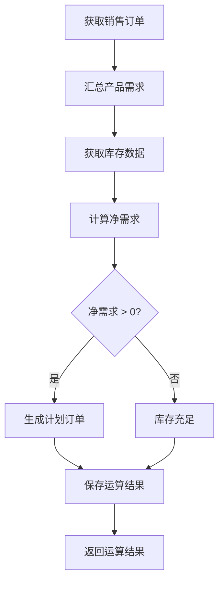

# MRP运算功能使用说明

## 📋 功能概述

MRP（Material Requirements Planning，物料需求计划）运算功能已成功开发完成，可以根据销售订单自动计算物料需求，生成采购和生产建议。

## ✅ 已完成的功能

### 后端部分

1. **VO类**
   - `MrpCalculationReqVO` - MRP运算请求参数
   - `MrpCalculationResultVO` - MRP运算结果响应

2. **Service层**
   - `MrpResultService.executeMrpCalculation()` - MRP运算核心方法
   - 自动获取销售订单需求
   - 自动获取库存数据
   - 计算净需求（毛需求 - 现有库存 - 计划接收量）
   - 生成运算结果并保存到数据库

3. **Controller层**
   - `POST /erp/mrp-result/execute` - MRP运算API接口

### 前端部分

1. **API调用**
   - `MrpResultApi.executeMrpCalculation()` - 前端调用方法

2. **页面功能**
   - "执行MRP运算"按钮
   - MRP运算参数配置对话框
   - MRP运算结果展示对话框

3. **权限配置**
   - `erp:mrp-result:execute` - MRP运算执行权限

## 🚀 使用步骤

### 1. 配置权限

首先执行SQL脚本添加MRP运算执行权限：

```bash
mysql -u root -p your_database < sql/mysql/add_mrp_execute_permission.sql
```

然后在系统管理中给相关角色分配`MRP运算执行`权限。

### 2. 准备基础数据

确保以下数据已准备：
- ✅ 产品信息
- ✅ 销售订单（已审核通过的订单）
- ✅ 库存数据

### 3. 执行MRP运算

#### 步骤1：进入MRP运算结果页面

导航路径：`生产管理 → MRP运算结果`

#### 步骤2：点击"执行MRP运算"按钮

点击页面上的 🔧 **执行MRP运算** 按钮

#### 步骤3：配置运算参数

在弹出的对话框中配置：

| 参数 | 说明 | 示例 |
|------|------|------|
| 计划开始日期 | MRP运算的开始时间 | 2025-01-01 00:00:00 |
| 计划结束日期 | MRP运算的结束时间 | 2025-03-31 23:59:59 |
| 包含产品 | 指定要计算的产品（不选则计算所有） | 可多选 |
| 考虑安全库存 | 是否在计算时考虑安全库存 | 默认开启 |
| 考虑在途数量 | 是否考虑在途采购/生产数量 | 默认开启 |

#### 步骤4：开始运算

点击"开始运算"按钮，系统将：
1. 获取销售订单中未完成的产品需求
2. 查询当前库存数据
3. 计算净需求
4. 生成MRP运算结果

#### 步骤5：查看运算结果

运算完成后会显示结果对话框，包含：

**统计信息：**
- 运算批次号
- 运算状态（成功/失败）
- 运算耗时
- 处理产品数
- 需要生产的产品数
- 需要采购的产品数
- 库存充足的产品数

**明细信息：**
- 产品名称
- 毛需求（销售订单需求）
- 现有库存
- 计划接收量
- 净需求
- 计划订单发放量
- 订单类型（生产订单/采购订单）
- 建议操作

### 4. 根据结果采取行动

根据MRP运算建议：

- **库存充足** → 无需处理
- **需要生产** → 创建生产订单
- **需要采购** → 创建采购订单

## 📊 MRP运算逻辑说明

### 核心公式

```
净需求 = 毛需求 - 现有库存 - 计划接收量 + 安全库存
```

### 计算流程



### 数据来源

1. **毛需求**
   - 来源：已审核的销售订单
   - 计算：订单数量 - 已出库数量

2. **现有库存**
   - 来源：库存表（erp_stock）
   - 按产品汇总所有仓库的库存

3. **计划接收量**
   - 来源：未完成的采购订单和生产订单
   - 当前版本暂为0（后续版本完善）

4. **安全库存**
   - 来源：MRP参数配置
   - 当前版本暂为0（后续版本完善）

## 📁 相关文件清单

### 后端文件

```
yudao-module-erp/src/main/java/cn/iocoder/yudao/module/erp/
├── controller/admin/mrpresult/vo/
│   ├── MrpCalculationReqVO.java         # 运算请求VO
│   └── MrpCalculationResultVO.java      # 运算结果VO
├── service/mrpresult/
│   ├── MrpResultService.java            # Service接口
│   └── MrpResultServiceImpl.java        # Service实现（核心逻辑）
└── controller/admin/mrpresult/
    └── MrpResultController.java         # Controller（API接口）
```

### 前端文件

```
original-yudao-ui/src/
├── api/erp/mrpresult/
│   └── index.ts                         # API调用方法
└── views/erp/mrpresult/
    └── index.vue                        # 页面（按钮+对话框）
```

### 数据库文件

```
sql/mysql/
└── add_mrp_execute_permission.sql       # 权限配置SQL
```

## 🔧 后续优化建议

### 1. 完善计划接收量计算
- [ ] 从采购订单获取在途采购数量
- [ ] 从生产订单获取在途生产数量

### 2. 增强安全库存功能
- [ ] 支持产品级别的安全库存配置
- [ ] 支持仓库级别的安全库存配置

### 3. BOM展开功能
- [ ] 根据BOM自动展开子物料需求
- [ ] 多层级BOM递归展开
- [ ] 考虑损耗率

### 4. 批量规则
- [ ] 支持固定批量
- [ ] 支持最小-最大批量
- [ ] 支持批量倍数

### 5. 提前期计算
- [ ] 支持产品提前期配置
- [ ] 根据提前期倒推需求日期

### 6. 预测需求
- [ ] 支持销售预测数据
- [ ] 与实际订单合并计算

### 7. 订单自动创建
- [ ] MRP运算后自动创建采购订单
- [ ] MRP运算后自动创建生产订单

### 8. 运算结果管理
- [ ] 运算结果对比分析
- [ ] 运算结果审批流程
- [ ] 历史运算记录查询

## ❓ 常见问题

### Q1: 运算后没有结果？
**A:** 检查以下几点：
- 是否有已审核的销售订单
- 销售订单是否有未完成的数量
- 时间范围是否正确

### Q2: 如何查看历史运算记录？
**A:** 在MRP运算结果列表中，可以通过"运算批次号"搜索查看历史记录。

### Q3: 可以重复运算吗？
**A:** 可以。每次运算会生成新的批次号和新的记录。

### Q4: 运算结果可以修改吗？
**A:** 可以。点击"编辑"按钮可以手工调整运算结果。

### Q5: 如何删除运算结果？
**A:** 
- 单条删除：点击每行的"删除"按钮
- 批量删除：勾选多条记录后，点击"批量删除"按钮

## 📞 技术支持

如有问题，请联系系统管理员或查看相关文档：
- [ERP系统功能模块关联分析.md](./ERP系统功能模块关联分析.md)
- [生产管理系统开发计划-细化版.md](./生产管理系统开发计划-细化版.md)

---

**开发完成时间**：2025-11-20  
**开发者**：芋道源码  
**版本**：v1.0

