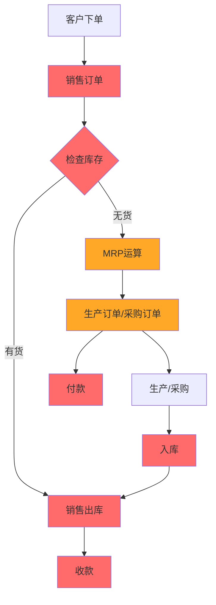

# ERP系统功能模块关联分析文档

**文档版本**：v1.0  
**创建时间**：2025-11-20  
**系统名称**：芋道ERP系统  

---

## 📊 模块总览

### 一级模块分类

| 模块 | 子功能数 | 业务领域 | 优先级 |
|------|----------|----------|--------|
| 产品管理 | 3 | 基础数据 | 🔴 核心 |
| 采购管理 | 4 | 供应链 | 🔴 核心 |
| 销售管理 | 4 | 供应链 | 🔴 核心 |
| 库存管理 | 7 | 供应链 | 🔴 核心 |
| 生产管理 | 16 | 生产制造 | 🟠 重要 |
| 财务管理 | 3 | 财务结算 | 🔴 核心 |
| 质量管理 | 4 | 质量控制 | 🟡 辅助 |
| 设备管理 | 2 | 设备维护 | 🟡 辅助 |
| 成本管理 | 3 | 成本核算 | 🟢 优化 |

**总计**：9个一级模块，46个二级功能模块

---

## 🔴 强关联模块（核心流程必需）

### 1. 产品管理 ⭐⭐⭐⭐⭐

**关联度**：🔴 **强关联**（系统基础，所有业务的前提）

#### 功能模块
| 功能 | 说明 | 是否必需 |
|------|------|----------|
| 产品信息 | 产品主数据，包含编码、名称、规格等 | ✅ 必需 |
| 产品分类 | 产品树形分类，便于管理 | ✅ 必需 |
| 产品单位 | 计量单位（件、个、kg等） | ✅ 必需 |

#### 业务关联
```
产品信息
├── → 销售订单（选择销售产品）
├── → 采购订单（采购原材料/产品）
├── → 生产订单（生产产品）
├── → 库存管理（库存盘点）
└── → BOM（产品结构）
```

#### 关键原因
- **基础数据源**：所有业务都基于产品
- **数据一致性**：统一的产品编码和信息
- **无法替代**：没有产品信息，系统无法运作

---

### 2. 销售管理 ⭐⭐⭐⭐⭐

**关联度**：🔴 **强关联**（业务驱动源头）

#### 功能模块
| 功能 | 说明 | 是否必需 |
|------|------|----------|
| 销售订单 | 客户订单，驱动整个业务流程 | ✅ 必需 |
| 销售出库 | 根据销售订单发货出库 | ✅ 必需 |
| 客户信息 | 客户基础资料 | ✅ 必需 |
| 销售退货 | 异常流程处理 | ⚠️ 可选 |

#### 业务流程
```mermaid
销售订单（创建）
    ↓
检查库存（是否有货）
    ├─ 有货 → 销售出库 → 财务收款
    └─ 无货 → 生产计划/采购计划
```

#### 核心依赖
- **上游**：客户信息、产品信息
- **下游**：库存管理、生产管理、财务管理
- **驱动力**：销售订单是整个ERP的业务起点

---

### 3. 采购管理 ⭐⭐⭐⭐⭐

**关联度**：🔴 **强关联**（物料供应保障）

#### 功能模块
| 功能 | 说明 | 是否必需 |
|------|------|----------|
| 采购订单 | 向供应商采购物料/产品 | ✅ 必需 |
| 采购入库 | 采购物料到货入库 | ✅ 必需 |
| 供应商信息 | 供应商基础资料 | ✅ 必需 |
| 采购退货 | 异常流程处理 | ⚠️ 可选 |

#### 业务流程
```
MRP运算/手工需求
    ↓
采购订单（创建）
    ↓
供应商发货
    ↓
采购入库（增加库存）
    ↓
财务付款
```

#### 核心依赖
- **上游**：MRP运算结果、产品信息、供应商信息
- **下游**：库存管理、财务管理
- **保障作用**：确保生产/销售所需物料及时供应

---

### 4. 库存管理 ⭐⭐⭐⭐⭐

**关联度**：🔴 **强关联**（供应链核心枢纽）

#### 功能模块
| 功能 | 说明 | 是否必需 |
|------|------|----------|
| 仓库信息 | 仓库/库位基础资料 | ✅ 必需 |
| 产品库存 | 实时库存数量和状态 | ✅ 必需 |
| 出入库明细 | 库存变动流水账 | ✅ 必需 |
| 其它入库 | 非采购入库（调整、退货等） | ⚠️ 可选 |
| 其它出库 | 非销售出库（报废、领用等） | ⚠️ 可选 |
| 库存调拨 | 仓库间货物转移 | ⚠️ 可选 |
| 库存盘点 | 定期盘点，账实相符 | ⚠️ 可选 |

#### 业务流程
```
                库存中心
                   ↓
    ┌──────────────┼──────────────┐
    ↓              ↓              ↓
采购入库      生产入库      销售出库
  （增加）      （增加）      （减少）
    ↓              ↓              ↓
  库存余额（实时更新，支撑决策）
```

#### 核心作用
- **数据中枢**：连接采购、销售、生产的核心
- **决策依据**：库存数据决定是否需要采购/生产
- **财务基础**：库存金额是财务核算的重要依据

---

### 5. 财务管理 ⭐⭐⭐⭐⭐

**关联度**：🔴 **强关联**（资金流闭环）

#### 功能模块
| 功能 | 说明 | 是否必需 |
|------|------|----------|
| 收款单 | 销售收款记录 | ✅ 必需 |
| 付款单 | 采购付款记录 | ✅ 必需 |
| 结算账户 | 银行账户、现金账户等 | ✅ 必需 |

#### 业务流程
```
销售订单 → 销售出库 → 收款单（资金流入）
采购订单 → 采购入库 → 付款单（资金流出）
```

#### 核心作用
- **资金闭环**：完成业务的资金结算
- **应收应付**：跟踪欠款和待付款
- **财务报表**：提供财务数据支撑

---

## 🟠 重要关联模块（生产型企业必需）

### 6. 生产管理 ⭐⭐⭐⭐

**关联度**：🟠 **重要关联**（制造企业核心，贸易企业可选）

#### 核心模块（强关联）
| 功能 | 说明 | 是否必需 |
|------|------|----------|
| 生产订单 | 生产任务单 | ✅ 必需 |
| 产品BOM | 物料清单，产品组成结构 | ✅ 必需 |
| 工艺路线 | 生产工序流程 | ✅ 必需 |
| 生产排程 | 生产计划和排期 | ✅ 必需 |
| 工单 | 车间执行任务单 | ✅ 必需 |
| MRP运算结果 | 物料需求计划 | ✅ 必需 |

#### 辅助模块（弱关联）
| 功能 | 说明 | 是否必需 |
|------|------|----------|
| BOM明细 | BOM结构查看 | ⚠️ 可选（查询辅助） |
| 工艺路线明细 | 工序详细信息 | ⚠️ 可选（查询辅助） |
| 排程明细 | 排程详细信息 | ⚠️ 可选（查询辅助） |
| MRP参数 | MRP运算参数配置 | ⚠️ 可选（初始化配置） |
| 工单进度 | 工单执行进度跟踪 | ⚠️ 可选（监控辅助） |
| 工时统计 | 人员工时统计 | ⚠️ 可选（成本核算） |
| 生产KPI | 生产绩效指标 | ⚠️ 可选（管理优化） |
| 生产报表 | 生产数据报表 | ⚠️ 可选（管理优化） |
| 看板配置 | 生产看板设置 | ⚠️ 可选（可视化） |

#### 业务流程
```
销售订单/库存需求
    ↓
MRP运算（物料需求计划）
    ↓
生产订单（创建）← BOM（物料清单）
    ↓                ↓
生产排程           工艺路线（工序）
    ↓                ↓
工单（车间执行）
    ↓
生产完工入库
```

#### 适用场景
- **制造企业**：🔴 强关联（必需）
- **贸易企业**：⚪ 无关联（不需要）
- **混合型企业**：🟠 部分必需

---

## 🟡 辅助关联模块（优化管理）

### 7. 质量管理 ⭐⭐⭐

**关联度**：🟡 **弱关联**（质量控制，可后期增加）

#### 功能模块
| 功能 | 说明 | 业务价值 |
|------|------|----------|
| 质检标准 | 质量检验标准定义 | 质量规范 |
| 质检项目 | 检验项目配置 | 质量规范 |
| 质检记录 | 质量检验记录 | 质量追溯 |
| 质检明细 | 检验项目明细 | 详细记录 |

#### 业务流程
```
采购入库 → 质检（IQC） → 合格入库/不合格退货
生产完工 → 质检（FQC） → 合格入库/不合格返工
销售出库 → 质检（OQC） → 合格发货/不合格拦截
```

#### 关联程度分析
- **流程依赖**：❌ 可绕过质检直接入库/出库
- **数据依赖**：✅ 需要产品信息
- **业务价值**：✅ 提升产品质量，减少退货
- **实施建议**：⚠️ 基础流程稳定后再上线

---

### 8. 设备管理 ⭐⭐

**关联度**：🟡 **弱关联**（设备维护，可后期增加）

#### 功能模块
| 功能 | 说明 | 业务价值 |
|------|------|----------|
| 设备管理 | 设备台账、设备档案 | 资产管理 |
| 设备状态 | 设备运行状态监控 | 故障预警 |

#### 业务流程
```
生产排程 → 选择设备
    ↓
工单执行 → 使用设备
    ↓
设备状态（记录使用情况）
    ↓
设备维护保养（预防性维护）
```

#### 关联程度分析
- **流程依赖**：❌ 可不指定设备进行生产
- **数据依赖**：✅ 需要设备基础信息
- **业务价值**：✅ 降低设备故障率，提高生产效率
- **实施建议**：⚠️ 设备较多的企业可考虑上线

---

## 🟢 优化关联模块（分析决策）

### 9. 成本管理 ⭐⭐

**关联度**：🟢 **弱关联**（成本核算，数据分析类）

#### 功能模块
| 功能 | 说明 | 业务价值 |
|------|------|----------|
| 标准成本 | 产品标准成本设定 | 成本基准 |
| 实际成本 | 产品实际发生成本 | 成本核算 |
| 成本差异 | 标准与实际成本对比 | 成本分析 |

#### 业务流程
```
产品信息 + BOM → 标准成本（计算）
    ↓
生产过程（材料、人工、制造费用）
    ↓
实际成本（归集）
    ↓
成本差异分析（标准 vs 实际）
```

#### 关联程度分析
- **流程依赖**：❌ 不影响业务流程
- **数据依赖**：✅ 需要采购、生产、人工等数据
- **业务价值**：✅ 成本控制、定价决策
- **实施建议**：⚠️ 业务稳定后，需要精细化管理时上线

---

## 📈 业务流程图

### 核心业务流程（强关联模块）



**说明**：
- 🔴 红色：强关联核心流程
- 🟠 橙色：制造企业核心流程

---

## 🎯 实施建议

### 第一阶段：核心流程（必须上线）⭐⭐⭐⭐⭐

**目标**：建立基础业务闭环

| 模块 | 优先级 | 工作量 | 风险 |
|------|--------|--------|------|
| 产品管理 | P0 | 低 | 低 |
| 客户/供应商信息 | P0 | 低 | 低 |
| 库存管理（基础） | P0 | 中 | 中 |
| 销售订单 | P0 | 中 | 中 |
| 采购订单 | P0 | 中 | 中 |
| 出入库管理 | P0 | 中 | 中 |
| 财务收付款 | P0 | 低 | 低 |

**预期成果**：
- ✅ 完成采购-库存-销售-财务闭环
- ✅ 库存数据实时准确
- ✅ 应收应付清晰可控

---

### 第二阶段：生产流程（制造企业必需）⭐⭐⭐⭐

**目标**：建立生产管理体系

| 模块 | 优先级 | 工作量 | 风险 |
|------|--------|--------|------|
| 产品BOM | P1 | 中 | 中 |
| 工艺路线 | P1 | 中 | 中 |
| MRP运算 | P1 | 高 | 高 |
| 生产订单 | P1 | 中 | 中 |
| 生产排程 | P1 | 高 | 高 |
| 工单执行 | P1 | 中 | 中 |

**预期成果**：
- ✅ 自动生成物料需求计划
- ✅ 生产计划清晰可控
- ✅ 车间执行有据可查

---

### 第三阶段：管理优化（提升管理水平）⭐⭐⭐

**目标**：精细化管理

| 模块 | 优先级 | 工作量 | 风险 |
|------|--------|--------|------|
| 质量管理 | P2 | 中 | 低 |
| 库存盘点/调拨 | P2 | 低 | 低 |
| 工单进度跟踪 | P2 | 中 | 低 |
| 设备管理 | P3 | 中 | 低 |

**预期成果**：
- ✅ 产品质量可控可追溯
- ✅ 库存管理更精细
- ✅ 生产过程可视化

---

### 第四阶段：数据分析（决策支持）⭐⭐

**目标**：数据驱动决策

| 模块 | 优先级 | 工作量 | 风险 |
|------|--------|--------|------|
| 成本管理 | P3 | 高 | 中 |
| 生产KPI | P3 | 中 | 低 |
| 生产报表 | P3 | 低 | 低 |
| 看板配置 | P3 | 低 | 低 |

**预期成果**：
- ✅ 成本数据准确
- ✅ 管理指标清晰
- ✅ 数据可视化呈现

---

## 📊 模块依赖关系矩阵

### 数据依赖关系

| 模块 | 依赖模块 | 依赖程度 |
|------|----------|----------|
| 销售订单 | 产品信息、客户信息 | 🔴 强依赖 |
| 采购订单 | 产品信息、供应商信息 | 🔴 强依赖 |
| 库存管理 | 产品信息、仓库信息 | 🔴 强依赖 |
| 生产订单 | 产品BOM、工艺路线 | 🔴 强依赖 |
| 生产排程 | 生产订单、设备信息 | 🟠 中依赖 |
| MRP运算 | 销售订单、BOM、库存 | 🔴 强依赖 |
| 质检记录 | 产品信息、质检标准 | 🟡 弱依赖 |
| 成本核算 | 采购、生产、人工数据 | 🟡 弱依赖 |

---

## 🚀 快速判断指南

### 如何判断某个模块是否必需？

#### ✅ 强关联（必须上线）的特征：
1. **流程阻断**：缺少该模块，业务无法继续
2. **数据源头**：其他模块依赖该模块数据
3. **财务相关**：涉及资金收付、库存价值
4. **法律要求**：税务、审计等法规要求

**示例**：
- 产品信息：✅（所有业务的基础）
- 销售订单：✅（业务驱动源头）
- 库存管理：✅（财务核算依据）

#### ⚠️ 弱关联（可延后上线）的特征：
1. **流程可选**：跳过该模块，业务仍可进行
2. **数据补充**：提供额外信息，但非必需
3. **管理优化**：提升效率，但非关键
4. **分析决策**：数据分析类功能

**示例**：
- 质量管理：⚠️（可先手工记录）
- 设备管理：⚠️（小规模企业可不用）
- 成本分析：⚠️（后期精细化管理）

---

## 💡 典型场景分析

### 场景1：纯贸易型企业

**核心模块**（必需）：
- ✅ 产品管理
- ✅ 客户/供应商管理
- ✅ 采购管理
- ✅ 销售管理
- ✅ 库存管理
- ✅ 财务管理

**可选模块**：
- ❌ 生产管理（全部不需要）
- ⚠️ 质量管理（简化版即可）
- ❌ 设备管理（不需要）
- ❌ 成本管理（简化核算）

**业务特点**：
- 无生产环节
- 以采购+销售为主
- 库存周转要求高

---

### 场景2：小型制造企业

**核心模块**（必需）：
- ✅ 产品管理
- ✅ 客户/供应商管理
- ✅ 采购管理
- ✅ 销售管理
- ✅ 库存管理
- ✅ 生产订单
- ✅ 简单BOM
- ✅ 财务管理

**可选模块**：
- ⚠️ 生产排程（手工排程可能更灵活）
- ⚠️ MRP运算（订单少，手工判断更快）
- ❌ 工艺路线（工序少，无需系统管理）
- ❌ 质量管理（手工记录）
- ❌ 设备管理（设备少）
- ❌ 成本管理（简化核算）

**业务特点**：
- 有简单生产
- 订单量小，变化快
- 人员少，系统要简单

---

### 场景3：中大型制造企业

**核心模块**（必需）：
- ✅ 产品管理（全部）
- ✅ 客户/供应商管理（全部）
- ✅ 采购管理（全部）
- ✅ 销售管理（全部）
- ✅ 库存管理（全部）
- ✅ 生产管理（大部分核心模块）
- ✅ 财务管理（全部）

**推荐模块**：
- ✅ 质量管理（全部）
- ✅ 设备管理（设备多需管理）
- ⚠️ 成本管理（精细化管理需要）

**业务特点**：
- 生产复杂，工序多
- 订单量大，需自动化
- 管理规范，需数据支撑

---

## 📝 总结与建议

### 核心原则

1. **先核心，后辅助**：优先上线强关联模块
2. **先简单，后复杂**：从基础功能开始，逐步完善
3. **先流程，后分析**：业务流程通了，再做数据分析
4. **按需上线**：根据企业实际情况选择模块

### 模块分级总结

#### 🔴 P0级（必须有）- 6个模块
- 产品管理
- 销售管理（核心功能）
- 采购管理（核心功能）
- 库存管理（核心功能）
- 财务管理

**适用**：所有企业

#### 🟠 P1级（制造必需）- 6个模块
- 生产订单
- 产品BOM
- 工艺路线
- 生产排程
- MRP运算
- 工单

**适用**：制造型企业

#### 🟡 P2级（管理优化）- 7个模块
- 质量管理（4个子模块）
- 库存盘点/调拨
- 工单进度
- 设备管理（2个子模块）

**适用**：中大型企业、管理规范企业

#### 🟢 P3级（数据分析）- 6个模块
- 成本管理（3个子模块）
- 工时统计
- 生产KPI
- 生产报表

**适用**：精细化管理企业

---

## 🔗 相关文档

- [ERP数据库字段问题修复报告](./ERP数据库字段问题修复报告.md)
- [排程明细问题解决报告](./排程明细问题解决报告.md)

---

**文档维护**：
- 📅 下次更新时间：业务流程调整时
- 👤 维护责任人：系统管理员
- 📧 问题反馈：如有疑问或建议，请联系管理员

